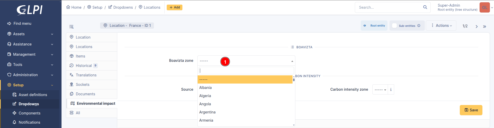
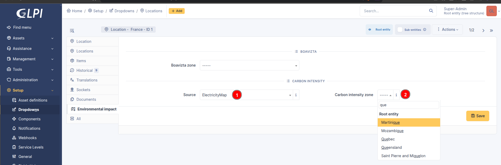

Configuration
=============

Automatic actions
-----------------

The plugin requires a working configuration of `automatic actions with CLI mode <https://glpi-user-documentation.readthedocs.io/fr/master/modules/configuration/crontasks.html>`_.
Check carefully that GLPI scheduler is running every minute.

Each asset has a tab where the user can see the calculated impacts or run their calculation. It is not necessary to run the calculation manually, except if the user wants to see immediate results. There is an automatic action, programmed once per day to run a batch of calculations.

Downloading carbon intensitiy data
^^^^^^^^^^^^^^^^^^^^^^^^^^^^^^^^^^

The plugin implements an automatic action for each data provider. Supported sources are :

* **RTE** for France (free, data back to 2012-01-01)
* **Electricity Maps** for most countries and regions in the world (free access limited to last 24 hours or full access with are supported)

.. note::
    RTE provides date for **produced** electricity only. As France imports and exports electricity the evaluation of **consumed** electricity is slighly different. When it is possible, prefer ElectricityMaps as it takes import / export into account.

.. note::
    Electricitymaps client supports free and paid access. As there is no way to distinguish these modes from API or the key, you must tick the checkbox "Free mode" if you are using the free access.

When an automatic action runs for the first time it setups supported regions in database. Once done, you may activate downloads for regions of interest.

Enable / disable carbon intensity data download
-----------------------------------------------

* Navigate in GLPI to **Setup > Dropdowns > box GLPI Carbon > Carbon intensity sources**

.. image:: images/plugin_dropdowns_intensity.png
    :alt: select carbon in dropdown tab
    :scale: 38%

* Select a data provider
* Open the tab **Carbon intensity zones**
* Find the country you want to check or set

.. image:: images/choose_country.png
    :alt: select the country
    :scale: 44%

* Toggle the flag **Download enabled** by clicking on its status

.. image:: images/enable_download.png
    :alt: enable download of the country
    :scale: 44%

.. note::
    If the list of regions or countries is empty then you need to run the automatic action of this source first.

Enable / disable automatic geocoding
------------------------------------

Boaviztapi needs an encoded country designation to improve the accuracy of its results. This is done by the plugin using geocoding services from Nominatim. It is disabled by default and can be enabled in the configuration page of the plugin. When enabled, it monitors changes in locations and tries to resolve the encoded country designation from the fields country, state, and town filled in a location.

It also has an automatic action to find the country designation for locations already in the database at installation time. This automatic action works only if geocoding is enabled, and runs once a day to solve 10 locations at a time to obey the Nominatim usage policy.

.. note::
    If you need to import a large number of locations, disable geocoding first to avoid any abuse, then let the automatic action resolve them slowly.

To enable it, go to **Setup > Plugins**, locate the Carbon plugin, click on its wrench and check the box **Enable geocoding**.

When the geocoding feature is disabled, it is advised to select the country field manually. In version 1.0.0 this field is under the map and duplicates the native text field **Country** from GLPI. In version 1.1.0 and later, go to the tab **Environnemental impact** and fill the dropdown **Boavizta zone**.

Inventory requirements
----------------------

All assets
^^^^^^^^^^

1. To calculate the emission of greenhouse gas related to energy consumed during use of your assets, the plugin needs to know when an asset is used for the first time and when its services is stopped.

To do so, the plugin searches for the following dates on order of decreasing precedence:

* **startup date** (Financial and administrative informations)
* **delivery date** (Financial and administrative informations)
* **date of purchase** (Financial and administrative informations)
* **creation date in the inventory** (in version 1.0.0 only)

One of these date fields must be populated.

.. note:: The creation date is ignored starting from version 1.1.0, this means that one of the 3 other fields must be filled.

.. image:: images/financial_information.png
    :alt: view financial information
    :scale: 36%

.. note:: Monitors rely on the location of the computer it is connected to, so there is no need to add it manually

1. The plugin needs to know where is an asset to determine which carbon intensity is applied to its energy consumption. In version 1.0.0 the associated location must have the field **Country** filled, in english language. In version 1.1.0 and later, the carbon intensity location is in the tab **Environmental impact**. The user must choose the source, then the zone (usually a country)

2. Each asset must be associated with a model so that the plugin can estimate CO2 emissions as closely as possible. This information can be pre-filled from a `template <https://glpi-user-documentation.readthedocs.io/fr/latest/modules/overview/templates.html>`_

.. image:: images/computer_model.png
    :alt: Asset's model
    :scale: 45%

4. It is preferable that the machines be inventoried by an agent so that the **components** tab is filled in as accurately as possible.
It is possible to do this manually but the automatic inventory seems more reliable.

.. image:: images/computer_components.png
    :alt: Asset's components
    :scale: 43%

Computers
^^^^^^^^^
Computers are usually powered on depending on working days and hours. You msut tell when computers are turned on in their tab **Environnemental impact**. In this place you can assign a usege profile which describes how the computers are powered on.

To create an usage profile, go in **Setup > Dropdowns > box GLPI Carbon > Computer usage profiles**.

.. image:: images/plugin_dropdowns.png
    :alt: select carbon in dropdown tab
    :scale: 38%

.. image:: images/usage_profile.png
    :alt: select carbon in dropdown tab
    :scale: 38%

Network equipments
^^^^^^^^^^^^^^^^^^

.. note:: The plugin assumes that the network equipments are powered on 24/7 and therefore there is no usage profile linked to them.