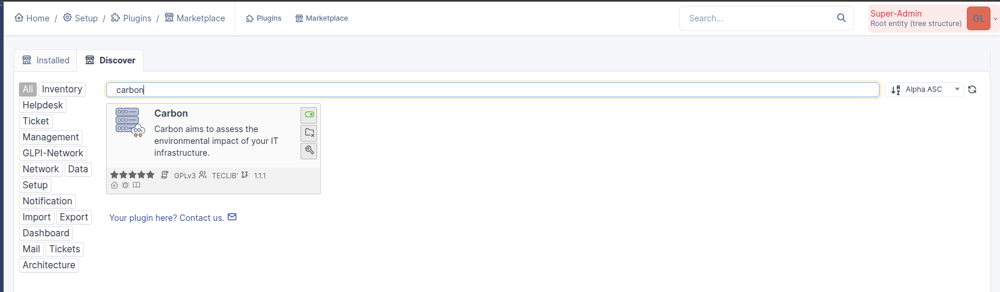

Install the Plugin
==================

.. warning:: During the installation process, the plugin creates many rows of data. The installation from GUI takes time and may even hit the PHP script execution timeout on slow servers. It is recommended to install from CLI as it shows a progress bar ensuring that the process is alive.

If the GUI installation does not complete before the PHP timeout (usually 30s), the administrator can run again the installation, either from GUI or CLI.

.. image:: images/install-cli.png
    :alt: Installation from CLI
    :scale: 38%

From the marketplace
--------------------

-  Go to the marketplace. Download and install the plugin **Carbon**.

Manually
--------

* Uncompress the archive.
* Move the ``carbon`` directory to the ``<GLPI_ROOT>/plugins`` directory
* Navigate to the *Configuration > Plugins* page,
* Install and activate the plugin.

.. warning::

   The plugin's directory must have the same name as the plugin:

     * **Good**: `glpi/plugins/carbon`
     * **Bad**: `glpi/plugins/carbon-master`
     * **Bad**: `glpi/plugins/carbon-1.0.0`

   Only one directory must contains the plugin's files of a single plugin in the GLPI plugins directory. **Don't rename the plugin's directory for backup, move it!**

Install plugin dependencies
---------------------------

The plugin requires Boavizta to calculate non-GWP impact of assets. It is recommended to set it up using Docker as described in the README file of the project https://github.com/Boavizta/boaviztapi.

The access URL of this service must be set in the configuration page of the plugin.

.. note::

   The plugin will work without Boavizta, but the non-GWP impact of assets will not be calculated.
