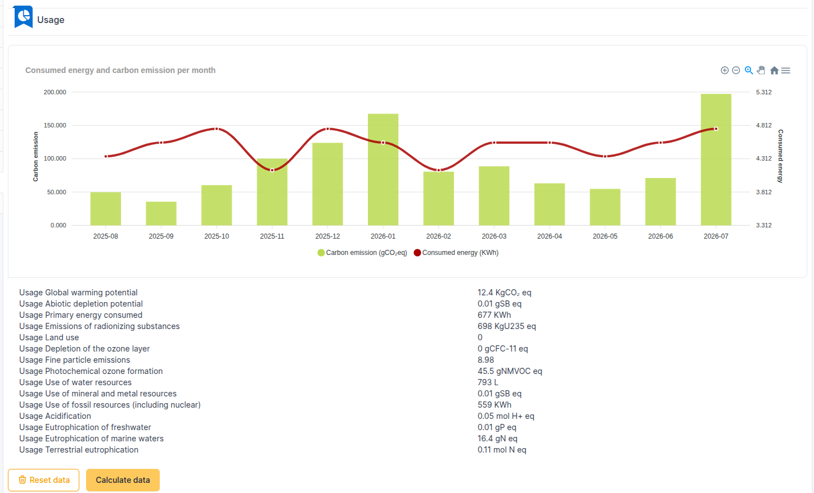
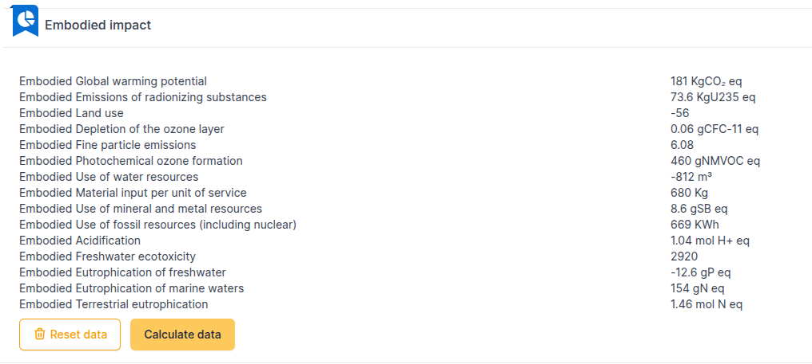

Reading data
============

In each asset, an Environmental impact tab is now visible.

.. image:: images/dashboard_view.png
    :alt: Global view of dashboard
    :scale: 21%

Asset usage
-----------

You can (for computers) select the appropriate profile as well as the planned lifespan (in months)

.. image:: images/asset_usage.png
    :alt: Setup the asset usage
    :scale: 51%

Historization status
--------------------

The historization status tells you whether all requirements are correctly met, ensuring that the data sent by Carbon is as accurate as possible.

.. image:: images/historization_status.png
    :alt: Read the historization status
    :scale: 61%

If an item is in red, the plugin will not be able to compute the usage greenhouse gas emissions of the asset.
Data in orange are optional and missing items. They might degrade the quality of he results.
Some items may work together. If all items of such group are missing then will show missing and required (red). If one of them is available, the others will show missing (orange).

Usage
-----

A graph displays energy consumption and carbon emissions per month for the last complete 12 months.

* Consumption in appears in red
* Carbon emissions in green

Using the toolbar at the top right, you can:

* Zoom in/out on a specific period
* Zoom through a selection
* Scroll
* Return to the initial presentation
* Export (SVG, PNG, CSV)

Additional data, ``gSbeq``, is available.
These are grams of antimony equivalent. This index is used to measure the depletion of abiotic resources (rare earths, minerals, etc.).

You can reset and calculate this data with the corresponding buttons. The user don't need to launch teh calculations for every asset. An automatic action, executed daily, does the job. Use the buttons only to reset the calculations in order to recalculate results with up to date data, or ifyou need immediate results.

Embodied data
-------------

In the life cycle of an asset, we can measure the environmental impact associated with its manufacture/destruction/recycling.
This data is visible in this insert

